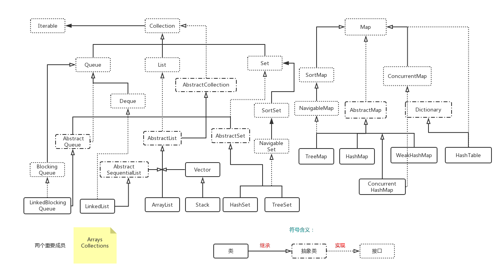

## Java集合关系总览



## 1. List
- List的官方解释
    
```text
An ordered collection (also known as a <i>sequence</i>).   The The user of this interface has precise control over where in the list each element is inserted. user can access elements by their integer index (position in
 the list), and search for elements in the list.
```
> List是一个有序的集合（就像序列一样）。此接口的用户可以精确控制列表中每个元素插入的位置。用户可以通过其整数索引(列表中的位置)访问元素，并在列表中搜索元素。
### 1.1 List的数据结构
### 1.2 ArrayList
### 1.3 LinkedList
### 1.4 Vector

----

## 2. Set
### 2.1 Set的数据结构
### 2.2 HashSet
### 2.3 TreeSet
### 2.4 LinkedSet

----

## 3. Queue
### 3.1 Queue的数据结构
### 3.2 LinkedList
### 3.3 PriorityQueue

----

## 4. Map
### 4.1 Map的数据结构
### 4.2 HashMap
### 4.3 TreeMap
### 4.4 Hashtable
### 4.5 LinkedHashMap