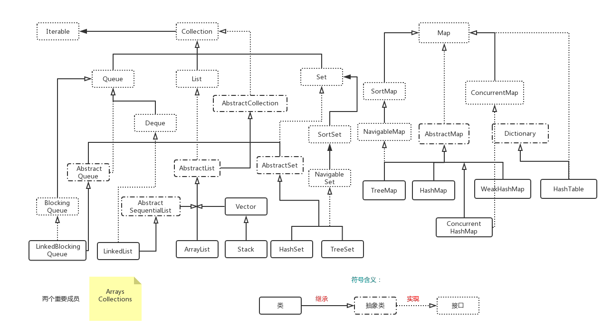

## Java集合关系总览



## 1. List
- List的官方解释
    
```text
An ordered collection (also known as a <i>sequence</i>).   The The user of this interface has precise control over where in the list each element is inserted. user can access elements by their integer index (position in
 the list), and search for elements in the list.
```
> List是一个有序的集合（就像序列一样）。此接口的用户可以精确控制列表中每个元素插入的位置。用户可以通过其整数索引(列表中的位置)访问元素，并在列表中搜索元素。
### 1.1 List的数据结构
### 1.2 ArrayList
### 1.3 LinkedList
### 1.4 Vector

----

## 2. Set
### 2.1 Set的数据结构
### 2.2 HashSet
### 2.3 TreeSet
### 2.4 LinkedSet

----

## 3. Queue
### 3.1 Queue的数据结构
### 3.2 LinkedList
### 3.3 PriorityQueue

----

## 4. Map
### 4.1 Map的数据结构
### 4.2 HashMap
   
#### 4.2.1 定义
> `HashMap` 是一个散列表，它存储的内容是键值对(key-value)映射。

#### 4.2.2 几个关键属性
- Entry[] table ：Entry实际上是一个单向链表
- size: HashMap的大小
- threshold: 是HashMap的阈值，等于容量(capacity)*负载因子(loadFactory)
- modCount: 是用来实现fail-fast机制的
- loadFactor: 负载因子   

#### 4.2.3 通过“拉链法”实现Hash表
```java
/**
 * 
 * 判断两个Entry是否相等:
 * 若两个Entry的“key”和“value”都相等，则返回true。否则，返回false
 *
 */
public final boolean equals(Object o) {
    if (o == this)
        return true;
    if (o instanceof Map.Entry) {
        Map.Entry<?,?> e = (Map.Entry<?,?>)o;
        if (Objects.equals(key, e.getKey()) &&
            Objects.equals(value, e.getValue()))
            return true;
    }
    return false;
}
```

#### 4.2.4 HashMap的几种遍历方式
### 4.3 TreeMap
### 4.4 Hashtable
### 4.5 LinkedHashMap

----
## 5. Stack
### 5.1 Stack的数据结构