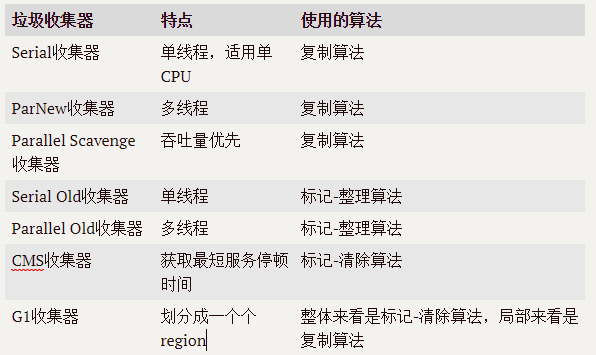

## 1. 设置GC的常用命令

| 参数 | 含义 |
| ---- | ---- |
| -XX:PrintGC | 打印GC日志 |
| -XX:+PrintGCDetails | 打印详细的GC日志,还会在退出前打印堆的详细信息 |
| -XX:+PrintHeapAtGC | 每次GC前后打印堆信息 |
| -XX:+PrintGCTimeStamps | 打印GC发生的时间 |
| -XX:+PrintGCApplicationConcurrentTime | 打印应用程序的执行时间 |
| -XX:+PrintGCApplicationStoppedTime | 打印应用由于GC而产生的停顿时间 |
| -XX:+PrintReferenceGC | 跟踪软引用、弱引用、虚引用和Finallize队列 |
| -Xloggc | 将GC日志以文件形式输出 |

## 2. 常见收集器的比较



## 3. 常见参数设置
    -Xms20M -Xmx20M -Xmn10M -XX:SurvivorRatio=8
    -Xms20m 表示堆空间初始大小为 20 M
    -Xmx20m 表示堆空间最大大小为 20 M
    -Xmn10m 表示新生代大小为 10M
    -XX:SurvivorRatio=8 表示Eden:Survivor=8:1

## 4. 回收器指定参数及对应GC日志
### 4.1 -XX:+UseSerialGC 表示强制使用Serial新生代收集器 + SerialOld老年代收集器
> 其中def new generation表示Serial收集器中的新生代
  tenured generation表示Serial Old收集器中的老年代
```Heap
 def new generation   total 9216K, used 2353K [0x00000000fec00000, 0x00000000ff600000, 0x00000000ff600000)
  eden space 8192K,  28% used [0x00000000fec00000, 0x00000000fee4c7e0, 0x00000000ff400000)
  from space 1024K,   0% used [0x00000000ff400000, 0x00000000ff400000, 0x00000000ff500000)
  to   space 1024K,   0% used [0x00000000ff500000, 0x00000000ff500000, 0x00000000ff600000)
 tenured generation   total 10240K, used 0K [0x00000000ff600000, 0x0000000100000000, 0x0000000100000000)
   the space 10240K,   0% used [0x00000000ff600000, 0x00000000ff600000, 0x00000000ff600200, 0x0000000100000000)
 Metaspace       used 3470K, capacity 4496K, committed 4864K, reserved 1056768K
  class space    used 381K, capacity 388K, committed 512K, reserved 1048576K
```
### 4.2 JDK1.8.0_151 默认使用的收集器是Parallel Scavenge新生代收集器 + Parallel Old老年代收集器
> PSYoungGen表示新生代,ParOldGen表示老年代
```
Heap
 PSYoungGen      total 9216K, used 2353K [0x00000000ff600000, 0x0000000100000000, 0x0000000100000000)
  eden space 8192K, 28% used [0x00000000ff600000,0x00000000ff84c7e0,0x00000000ffe00000)
  from space 1024K, 0% used [0x00000000fff00000,0x00000000fff00000,0x0000000100000000)
  to   space 1024K, 0% used [0x00000000ffe00000,0x00000000ffe00000,0x00000000fff00000)
 ParOldGen       total 10240K, used 0K [0x00000000fec00000, 0x00000000ff600000, 0x00000000ff600000)
  object space 10240K, 0% used [0x00000000fec00000,0x00000000fec00000,0x00000000ff600000)
 Metaspace       used 3471K, capacity 4496K, committed 4864K, reserved 1056768K
  class space    used 381K, capacity 388K, committed 512K, reserved 1048576K
```
### 4.3 -XX:+UseParNewGC: 强制使用ParNew新生代收集器+Serial Old老年代收集器
```
Heap
 par new generation   total 9216K, used 2353K [0x00000000fec00000, 0x00000000ff600000, 0x00000000ff600000)
  eden space 8192K,  28% used [0x00000000fec00000, 0x00000000fee4c7e0, 0x00000000ff400000)
  from space 1024K,   0% used [0x00000000ff400000, 0x00000000ff400000, 0x00000000ff500000)
  to   space 1024K,   0% used [0x00000000ff500000, 0x00000000ff500000, 0x00000000ff600000)
 tenured generation   total 10240K, used 0K [0x00000000ff600000, 0x0000000100000000, 0x0000000100000000)
   the space 10240K,   0% used [0x00000000ff600000, 0x00000000ff600000, 0x00000000ff600200, 0x0000000100000000)
 Metaspace       used 3438K, capacity 4496K, committed 4864K, reserved 1056768K
  class space    used 376K, capacity 388K, committed 512K, reserved 1048576K
Java HotSpot(TM) 64-Bit Server VM warning: Using the ParNew young collector with the Serial old collector is deprecated and will likely be removed in a future release
```
### 4.4 -XX:+UseConcMarkSweepGC: 使用ParNew新生代收集器 + CMS老年代收集器
```
Heap
 par new generation   total 9216K, used 2334K [0x00000000fec00000, 0x00000000ff600000, 0x00000000ff600000)
  eden space 8192K,  28% used [0x00000000fec00000, 0x00000000fee47b10, 0x00000000ff400000)
  from space 1024K,   0% used [0x00000000ff400000, 0x00000000ff400000, 0x00000000ff500000)
  to   space 1024K,   0% used [0x00000000ff500000, 0x00000000ff500000, 0x00000000ff600000)
 concurrent mark-sweep generation total 10240K, used 0K [0x00000000ff600000, 0x0000000100000000, 0x0000000100000000)
 Metaspace       used 3473K, capacity 4496K, committed 4864K, reserved 1056768K
  class space    used 381K, capacity 388K, committed 512K, reserved 1048576K
``` 
### 4.5 -XX:+UseG1GC:使用G1收集器
```
Heap
 garbage-first heap   total 20480K, used 2048K [0x00000000fec00000, 0x00000000fed000a0, 0x0000000100000000)
  region size 1024K, 3 young (3072K), 0 survivors (0K)
 Metaspace       used 3471K, capacity 4496K, committed 4864K, reserved 1056768K
  class space    used 381K, capacity 388K, committed 512K, reserved 1048576K
```